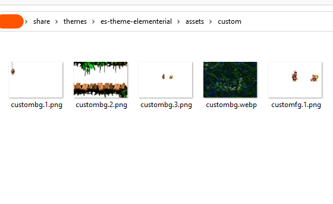

# Using Custom Backgrounds

To use this feature you need to resize or crop a image for your device.

For example, if you have a RG351P:
* Choose a image to edit.
* Resize the image to 480px wide per 320px tall.
  * That way, the image will be exactly resized to the screen resolution. If the image is bigger than the screen resolution EmulationStation will try to scale it down, your image will be presented pixelated.
* The image need to be cropped to the 3:2 aspect ratio. If you don't know what it mean, stay with the resolution numbers.
  * That way, the image will fit exactly into the screen and will not be stretched.
*  After that, save the image as ***custombg***. You can save as **PNG, JPG** or **WEBP**.  This theme supports transparent backgrounds.
*  Place the saved image at the theme folder **\[Theme Folder\]/assets/custom/**
*  Restart EmulationStation.

If you need, you can stack up to 4 custom backgrounds. The process is identical to the above mentioned. The difference is at the file name.

After **custombg**, you can save **custombg.1**, **custombg.2**, **custombg.3** for layer 1, layer 2 and layer 3 respectively.

If you need, you can stack up to 3 layers above systems carousel. The process is identical, but you need to save as **customfg.1**, **customfg.2** and **customfg.3**.

For these new layers, save them as **PNG** or **WEBP**. **JPG** images will not be loaded.

Note: Updating the theme thorough AmberElec's theme updater will remove custom backgrounds.

## For Reference

* `RG351P/M`:  480 x  320 pixels
* `RG531MP/V`:  640 x  480 pixels
* `RG552`: 1920 x 1152 pixels