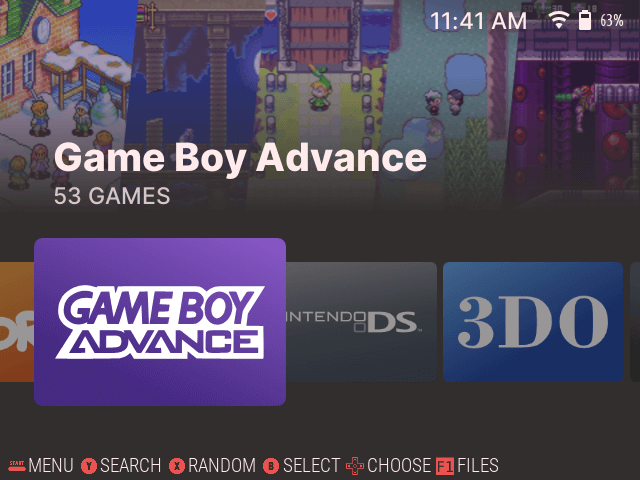
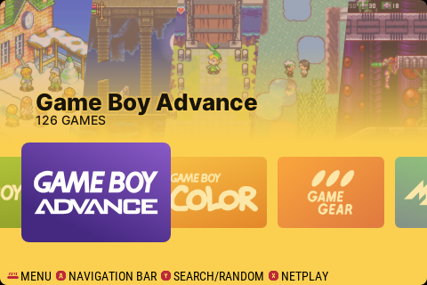
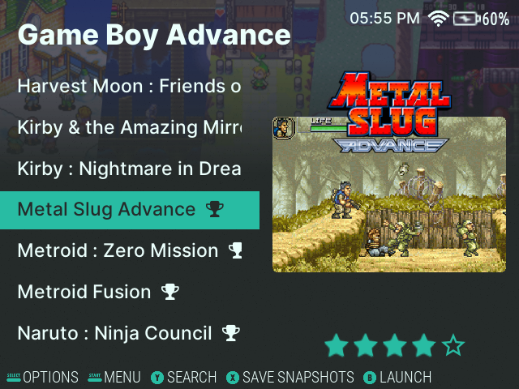
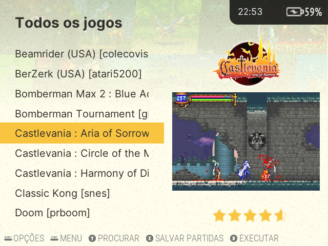
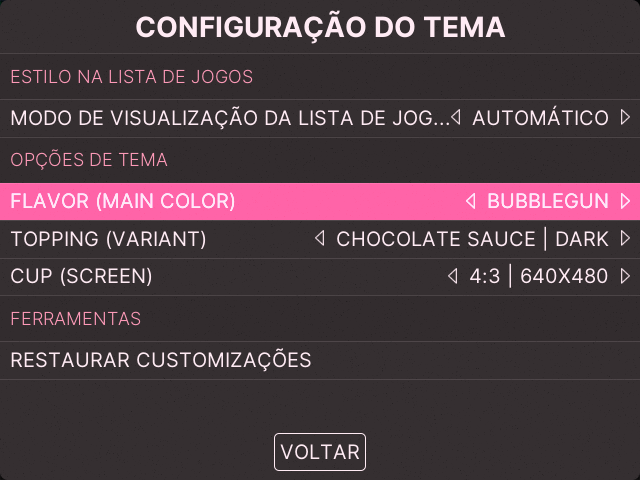
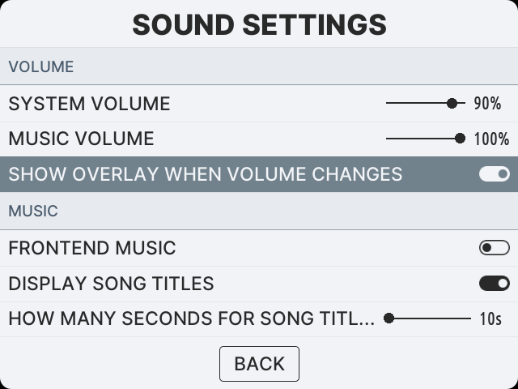

# About

**For instructions regard Custom Backgrounds, please read [CUSTOMBG.md](/CUSTOMBG.md)**

Elementerial is a theme built totally from scratch for EmulationStation.
It's based on Android TV's interface using some principles from Material Design with the adition of ElementaryOS color palette.

This theme has 14 color schemes:

* Strawberry (Red)
* Orange
* Banana (Yellow)
* Lime (Green)
* Mint (Turquoise)
* Blueberry (Blue)
* Grape (Purple)
* Bubblegun (Pink)
* Cocoa (Brown)
* Slate (Gray)
* SNES Scheme (based on the SNES aged carcass color. Yellowish Gray + Purple)
* Gameboy (based on the GB carcass. Gray + Claret + Green)
* Pikachu Edition (based on the GB Pikachu Edition. Vibrant Yellow + Blue + Red)
* Red Fruits (just a fancy color combination. Blue + Red + Purple)

And 2 styles:
* Dark
* Light

 

# Compatibility

Elementerial was made for the following resolutions:

- **480x320** (3:2 screen ratio), tested on Anbernic RG351M running AmberElec
- **640x480** (4:3 screen ratio), tested on VirtualBox running Batocera
- **1920x1152** (5:3 screen ratio), tested on VirtualBox running Batocera

\* It's possible to use Elementerial in other resolutions and systems based on EmulationStation, however full compatibility is not guaranteed.

 

# Screenshots
## Main Screen
|  |  |
| :-----------------------------: | :------------------------------: |
|        Strawberry + Dark        |     Pikachu Edition + Light      |

## Game List
|  |  |
| :-----------------------------: | :------------------------------: |
|   Mint + Dark + Detailed View   | SNES Sheme + Light + Boxes View  |

## Menu
|  |  |
| :-------------------------: | :--------------------------: |
|      Blueberry + Dark      |    Game Boy Scheme + Light    |

 

# Supported Platforms

**Systems:** 
3DO,
Amiga,
Amiga CD32,
Amstrad CPC,
Atari 800,
Atari 2600,
Atari 5200,
Atari 7800,
Atari Lynx,
Atari ST,
Atomiswave,
Capcom PlaySystem 1,
Capcom PlaySystem 2,
Capcom PlaySystem 3,
Channel F,
Coleco Vision,
Commodore 16,
Commodore 64,
Commodore 128,
Commodore VIC-20,
Daphne,
Doom,
Dreamcast,
EasyRPG,
Famicom,
Famicom Disk System,
Final Burn Neo,
Game&Watch,
Gameboy & Hacks,
Gameboy Color & Hacks,
Gameboy Advance & Hacks,
Gamegear & Hacks,
Homebrew,
Intellivision,
Java,
Mame,
MasterSystem,
Megadrive / Genesis & Hacks,
Megaduck,
MS-DOS / PC,
MSX,
MSX2,
Naomi,
NEC Pc88,
NEC Pc98,
NeoGeo,
NeoGeo CD,
NeoGeo Pocket,
NeoGeo Pocket Color,
NES & Hacks,
Nintendo 64,
Nintendo DS,
Odissey²,
OpenBor,
PC Engine / TurboGrafx 16,
PC Engine CD / TurboGrafx CD,
PC Engine SuperGrafx,
PC-FX,
PICO-8,
PlayStation,
Ports,
Pokémini,
PSP,
PSP Minis,
Satellaview,
Saturn,
ScummVM,
SC-3000,
Sega 32x,
Sega CD / Mega CD,
SG-1000,
Sharp X1,
Sharp X68000,
Sinclair ZX81,
Sinclair ZX Spectrum,
Solarus,
Sufami,
Super Gameboy,
Super Famicom,
Super Nintendo & Hacks & MSU-1,
SuperVision,
Tic-80,
Uzebox,
Vectrex,
Videopac,
VirtualBoy,
Wolfenstein,
WonderSwan,
WonderSwan Color,
and Others.

**Collections:** 2 Players, 4 Players, Arcade, Arcade Vertical, Pistol Games, Screenshots, Custom Collections, Tools, Favorites, All Games, Never Played, Last Played, RetroAchievements, MPlayer.

 

# License

All [videogame and computer system logos](./assets/logos/) used are the property of their respective Developers/Producers/Distributors/Licensors.

Some logos were taken from [Dan Patrick's set](https://archive.org/details/console-logos-professionally-redrawn-plus-official-versions). (Thanks for the great work).

Some [fonts](./assets/fonts/) are licensed under Apache 2.0 and SIL Open Font License.

Some [icons](./assets/icons/) are licensed under Apache 2.0 or their respective license.

All the files, code and images not mentioned abore are licensed under the [MIT License](./LICENSE).

 

# Made With

